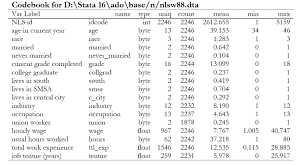

# Phase 1: Explore the data

Analyzing NGO data in India in  the existing data sources. This involves reviewing old CSV files and summarizing the content to understand the types of data that are available. This helps gain a deeper understanding of the types of data, common errors, and missing information. Initial cleaning and transformation may be necessary to convert text data into numerical representations, remove stop words, and irrelevant information.

The goal of this exploration is to gain a comprehensive understanding of the data and domain, providing a solid foundation for subsequent steps in the data analysis process and ensuring the analysis is well-informed and accurate.

```{admonition} [Codebook](https://github.com/DaanMatch/Codebook)



A codebook is a document that provides detailed information about the variables, data elements, and coding schemes used in a project.

A codebook typically includes information about the variables, such as their names, definitions, measurement scales, missing data codes, and any transformations that have been applied to the data. It may also include information about the data source, the sample size, and any other relevant details about the data.

The purpose of a codebook is to provide a standardized and consistent reference for the data, making it easier for us to understand and use the data correctly.
```

```{admonition} This admonition was styled...
:class: tip
1. Title: Give the histogram a descriptive title that summarizes the main findings of the data. This should be brief, but informative.
2. X and Y Axis Labels: Label the x-axis with the variable that is being plotted, and the y-axis with the frequency or count of the observations.
3. Units: Make sure to include the units of measurement on the axes if applicable.
4. Legend: If the histogram is part of a larger figure with multiple plots, include a legend to help the audience understand what each plot represents.
5. Data Source: If applicable, include a note about the data source, sample size, and date range of the data.
Annotate the Plot: Highlight important features or patterns in the histogram with annotations or lines.
6. Style: Choose colors and styles that are easy to read and clearly convey the information.
```

[Tips on Coding for a Team Project](https://docs.google.com/document/d/19fB5ppzBzdMjTNImoUziohq8d1AB84rDN_DavQGhKAY/edit)
