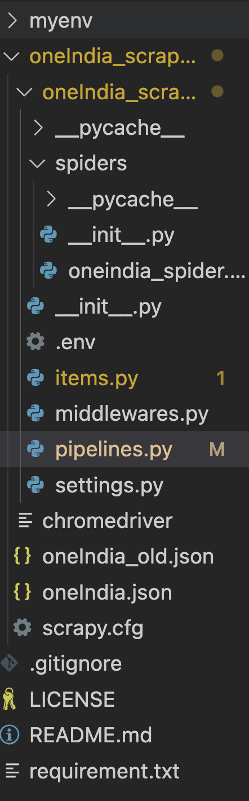
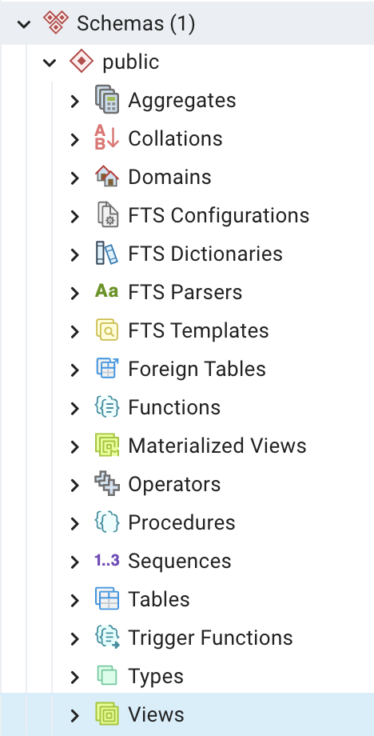
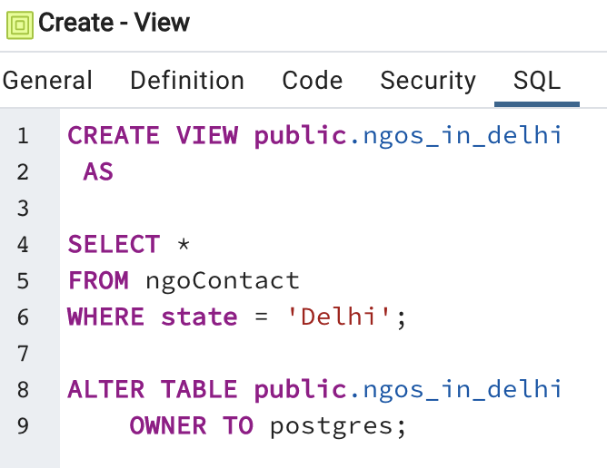

# Phase 3.5: Connecting spider to database



## items.py

```python
#items.py

import scrapy
from scrapy.loader.processors import MapCompose, TakeFirst
from datetime import datetime

def convert_date(text):
    # convert string March 14, 1879 to Python date
    return datetime.strptime(text, '%B %d, %Y')

def remove_newlines(s):
    return s.replace('\n', '')

def replace_newlines(s):
    return s.replace('\n', ' ')

class OneIndiaNgo(scrapy.Item):
    """
    A class to represent an NGO and its information.

    Attributes:
        name (scrapy.Field): The name of the NGO.
        address (scrapy.Field): The address of the NGO.
        city (scrapy.Field): The city where the NGO is located.
        state (scrapy.Field): The state where the NGO is located.
        telephone (scrapy.Field): The telephone number of the NGO.
        mobile (scrapy.Field): The mobile number of the NGO.
        website (scrapy.Field): The website of the NGO.
        email (scrapy.Field): The email address of the NGO.
        ngoType (scrapy.Field): The type of NGO.
        regNo (scrapy.Field): The registration number of the NGO.
        regDate (scrapy.Field): The registration date of the NGO.
        areasOfHelp (scrapy.Field): The development areas where the NGO provides help.
    """
    name = scrapy.Field(
        input_processor=MapCompose(str.strip, remove_newlines, str.title),
        output_processor=TakeFirst()
    )
    address = scrapy.Field(
        input_processor=MapCompose(str.strip, replace_newlines, str.title),
        output_processor=TakeFirst()
    )
    city = scrapy.Field(
        input_processor=MapCompose(str.strip, str.title),
        output_processor=TakeFirst()
    )
    state = scrapy.Field(
        input_processor=MapCompose(str.strip, str.title),
        output_processor=TakeFirst()
    )
    telephone = scrapy.Field(
        input_processor=MapCompose(str.strip),
        output_processor=TakeFirst()
    )
    mobile = scrapy.Field(
        input_processor=MapCompose(str.strip),
        output_processor=TakeFirst()
    )
    website = scrapy.Field(
        input_processor=MapCompose(str.strip),
        output_processor=TakeFirst()
    )
    email = scrapy.Field(
        input_processor=MapCompose(str.strip),
        output_processor=TakeFirst()
    )
    ngoType = scrapy.Field(
        input_processor=MapCompose(str.strip, str.title),
        output_processor=TakeFirst()
    )
    regNo = scrapy.Field()
    regDate = scrapy.Field(
        input_processor=MapCompose(convert_date),
        output_processor=TakeFirst()
    )
    areasOfHelp = scrapy.Field(
        input_processor=MapCompose(str.strip),
        output_processor=TakeFirst()
    )
```

## Saving scraped data to postgres database with scrapy pipelines

[Item Pipelines](https://docs.scrapy.org/en/latest/topics/item-pipeline.html) are Scrapy's way of process data scraped by spiders.

After an item has been scraped by a spider, it is sent to the Item Pipeline which processes it through a sequence of steps that can be configured to clean and process the scraped data before ultimately saving it somewhere. [Tutorial ](https://scrapeops.io/python-scrapy-playbook/scrapy-save-data-postgres/)

You can use Item Pipelines to:

- Clean HTML data
- Validate scraped data
- Checking for and removing duplicate data
- Storing the data in database

```python
#pipelines.py

from itemadapter import ItemAdapter
import psycopg2
from dotenv import load_dotenv
import os

class OneindiaScraperPipeline:

    def __init__(self):
        load_dotenv()  # load the variables from .env file
        HOST = os.getenv('DB_HOST')
        DATABASE = os.getenv('DB_NAME')
        USER = os.getenv('DB_USER')
        PASSWORD = os.getenv('DB_PASSWORD')
        # Connection parameters
        param_dic = {
            "host"      : HOST,
            "database"  : DATABASE,
            "user"      : USER,
            "password"  : PASSWORD
        }

        # Create/Connect to database
        self.connection = psycopg2.connect(**param_dic)

        # Create cursor, used to execute commands
        self.cur = self.connection.cursor()

        ## Create quotes table if none exists
        self.cur.execute("""
        CREATE TABLE IF NOT EXISTS NgoContact
        (
        NgoId UUID,
        NgoName text,
        OrgEmail text,
        OfficePhone text,
        PrimaryPoc text,
        PrimaryPocPhone text,
        SecondaryPoc text,
        SecondaryPocPhone text,
        MailingAddress text,
        PhysicalAddress text,
        FieldOffices text,
        OrgType text,
        OrgWebsite character varying(2048),
        Facebook character varying(2048),
        Twitter character varying(2048),
        Instagram character varying(2048),
        Youtube character varying(2048),
        Whatsapp text,
        OtherSocials text,
        ExecutiveDirector text,
        TechnicalSupport text,
        ChairmanName text,
        ChairmanMobile text,
        ChairmanEmail text,
        ViceChairmanName text,
        ViceChairmanMobile text,
        ViceChairmanEmail text,
        SecretaryName text,
        SecretaryMobile text,
        SecretaryEmail text,
        AssistantSecretaryName text,
        AssistantSecretaryMobile text,
        AssistantSecretaryEmail text
        )
        """)
    def process_item(self, item, spider):

        # Check to see if text is already in database 
        self.cur.execute("select * from NgoContact where ngoName = %s", (item['name'],))
        result = self.cur.fetchone()

        # If it is in DB, create log message
        if result:
            spider.logger.warn("Item already in database: %s" % item['name'])

        # If ngo isn't in the DB, insert data
        else:
            # Define insert statement
            self.cur.execute(""" insert into NgoContact (ngoName, OrgEmail, OfficePhone, OrgWebsite, MailingAddress, PhysicalAddress, OrgType) 
                                values (%s,%s,%s,%s,%s,%s,%s)""", (
                item["name"],
                item["email"],
                item["telephone"],
                item["website"],
                item["address"],
                item["address"],
                item["ngoType"]
            ))

            ## Execute insert of data into database
            self.connection.commit()

        
        return item
    
    def close_spider(self, spider):
        ## Close cursor & connection to database 
        self.cur.close()
        self.connection.close()
```

## settings.py

```python
# Configure item pipelines
# See https://docs.scrapy.org/en/latest/topics/item-pipeline.html
ITEM_PIPELINES = {
    'oneIndia_scraper.pipelines.OneindiaScraperPipeline': 300,
}
```

## SQL Views

CREATE VIEW defines a view of a query. The view is not physically materialized. Instead, the query is run every time the view is 
referenced in a query.

Create a view consisting of all comedy films example:

```sql
CREATE VIEW comedies AS
    SELECT *
    FROM films
    WHERE kind = 'Comedy';
```






## TODOs

- Update scrapy spider with proper documentation and settings for item and pipeline
- Pull request to [webscrape](https://github.com/DaanMatch/webscrape) and [codebook](https://github.com/DaanMatch/Codebook) repositories
- Submit [Meeting Feedback form](https://docs.google.com/forms/d/e/1FAIpQLSeqIDZzhh5mC1VLh9GpZIyC1YO30XlnoLPgzT8YatSQrTlx4w/viewform?usp=sf_link)
- Create sql views
- Example data anlaysis presentations [1](https://drive.google.com/file/d/1JIDnsaLXAx2qnWM86yfrRKLWF5B_ofHU/view), [2](https://github.com/nktnlx/data_analysis_course/blob/main/37_final_project/my_project_slides.pdf)
